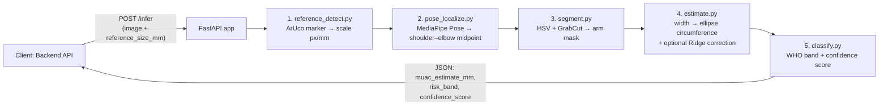
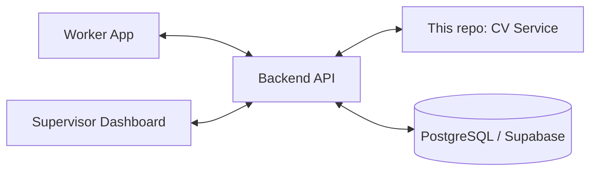

# PoshanScan CV Service

**AI-assisted Mid-Upper Arm Circumference (MUAC) estimation from a single smartphone photo.**

This microservice is the computer-vision engine behind [PoshanScan](https://github.com/poshanscan) — it takes a photo of a child's upper arm captured next to a printed reference marker, and returns an estimated MUAC measurement, a WHO screening band (Normal / MAM / SAM), and a confidence score. It exists to assist — not replace — manual MUAC tape screening used by frontline health workers to detect acute child malnutrition.

🟢 **Live:** `https://poshanscan-ml-cv-service.onrender.com` · Interactive API docs: [`/docs`](https://poshanscan-ml-cv-service.onrender.com/docs)

> Free-tier hosting spins down after inactivity — the first request after a while may take 30–60 seconds to wake up.

---

## What it does

```
 1. Photo in (arm + ArUco marker)
          │
          ▼
 2. Detect the marker  →  real-world scale (px per mm)
          │
          ▼
 3. Locate shoulder–elbow midpoint  →  the MUAC measurement site
          │
          ▼
 4. Segment the arm from the background
          │
          ▼
 5. Measure arm width  →  convert to an estimated circumference
          │
          ▼
 6. Classify: Normal / MAM / SAM  +  confidence score
          │
          ▼
 7. Structured JSON out
```

No step is a black box — every stage is a plain, inspectable function with its own confidence signal, and the service returns a clean, typed error (never a raw crash) if any stage fails.

---

## Live demo


The deployed service's interactive API docs at [`/docs`](https://poshanscan-ml-cv-service.onrender.com/docs), showing a real `POST /infer` call against the hosted pipeline and its JSON response.

---

## Architecture



This service is one of four independent repositories in the PoshanScan system (CV service, backend API, worker app, supervisor dashboard), each developed and deployed separately and connected only through REST APIs.



---

## API Reference

### `GET /health`
Liveness check.
```json
{ "status": "ok" }
```

### `POST /infer`
Runs the full MUAC pipeline on an uploaded image.

**Request** — `multipart/form-data`

| Field | Type | Required | Default | Description |
|---|---|---|---|---|
| `image` | file | ✅ | — | Photo of the upper arm with a reference marker in frame |
| `age_category` | string | ✅ | — | Either `"child_6_59m"` (WHO 6–59 month paediatric screening) or `"adult"` (adult/maternal MUAC scale). **No other value is accepted.** |
| `reference_type` | string | ❌ | `aruco` | Reference object type (currently only `aruco` is implemented) |
| `reference_size_mm` | number | ❌ | `50` | Printed marker edge length, in millimetres |

```bash
curl -X POST https://poshanscan-ml-cv-service.onrender.com/infer \
  -H "accept: application/json" \
  -F "image=@arm_photo.jpg;type=image/jpeg" \
  -F "age_category=child_6_59m" \
  -F "reference_type=aruco" \
  -F "reference_size_mm=50"
```

**Response — `200 OK`**
```json
{
  "muac_estimate_mm": 118.6,
  "risk_band": "MAM",
  "age_category": "child_6_59m",
  "confidence_score": 0.87,
  "quality_flags": {
    "reference_detected": true,
    "arm_detected": true,
    "segmentation_ok": true
  },
  "pipeline_version": "v1.0"
}
```

| Field | Meaning |
|---|---|
| `risk_band` | Classification band. For `child_6_59m`: `"Normal"`, `"MAM"`, `"SAM"`. For `adult`: `"Normal"`, `"Moderate"`, `"Severe"` |
| `age_category` | The category applied — `"child_6_59m"` or `"adult"` — echoed back so the response is self-documenting |
| `confidence_score` | `0.0`–`1.0`, a weighted combination of marker, pose, and segmentation confidence (§ below) |
| `quality_flags` | Per-stage pass/fail, useful for debugging a low-confidence result |

**Response — `422 Unprocessable Entity`** (bad capture — the client should prompt a retake)
```json
{ "error": "age_category_required", "message": "age_category must be specified as 'child_6_59m' or 'adult'." }
```
or
```json
{ "error": "reference_object_not_detected", "message": "No ArUco reference marker was found in the image." }
```
or
```json
{ "error": "arm_not_detected", "message": "Could not localise a shoulder\u2013elbow pair for MUAC measurement." }
```

**Response — `500 Internal Server Error`** — any unexpected failure, returned as a structured error rather than a raw stack trace.

Full interactive schema, including the `Body_infer_infer_post`, `InferResponse`, `ErrorResponse`, `HealthResponse`, and `QualityFlags` models, is available at [`/docs`](https://poshanscan-ml-cv-service.onrender.com/docs).

### Why only two `age_category` values?

MUAC cutoffs are not universal — they are calibrated against age- and sex-specific population references, and using the wrong scale can silently misclassify someone as normal when they are malnourished, or flag a false alarm.

- **`child_6_59m`** uses the WHO community-screening cutoffs (SAM < 115 mm, MAM 115–124.9 mm, Normal ≥ 125 mm) from the 2009 WHO guidance on community-based management of SAM. These are the globally accepted field thresholds for that age window.
- **`adult`** uses the published adult/maternal MUAC screening scale (Severe < 210 mm, Moderate 210–229 mm, Normal ≥ 230 mm), calibrated against BMI < 16.5 kg/m² and < 18.5 kg/m² respectively (Ferro-Luzzi & James 1996; Collins et al. 2000). This scale is used in MSF/UNHCR field nutrition protocols for adults and pregnant/lactating women.
- **Ages 5–19 years are explicitly not supported.** No single globally standardised MUAC-only cutoff exists for the 5–19 year bracket. WHO recommends BMI-for-age z-scores (BAZ) for that range, which requires sex and precise age — neither of which this system collects. Accepting an ambiguous "adolescent" category and applying either child or adult cutoffs would produce unsafe results, so the API rejects all values other than `"child_6_59m"` and `"adult"` with a clear error.

---

## How the pipeline works

### 1. Reference-marker detection & scale calibration — `reference_detect.py`
Detects a printed ArUco marker (`DICT_4X4_50`, OpenCV's `aruco` module) placed beside the arm. The mean of the marker's four detected side lengths (in pixels) is divided by its known physical size to get a scale factor:

```
scale (px/mm) = mean(side1, side2, side3, side4) / marker_size_mm
```

A confidence proxy is computed as *shortest side ÷ longest side* — a front-parallel marker has four near-equal sides (confidence ≈ 1); heavy perspective distortion lowers it. No marker found → `reference_object_not_detected`, no further processing.

### 2. Arm localisation — `pose_localize.py`
Uses **MediaPipe Pose** to find the shoulder and elbow landmarks (left side tried first, falling back to right). Their pixel midpoint is the MUAC measurement site — the same anatomical point a health worker locates manually with the shoulder-to-elbow method:

```
midpoint = ((x_shoulder + x_elbow) / 2, (y_shoulder + y_elbow) / 2)
```

Confidence is the mean of MediaPipe's own landmark visibility scores; below `0.3` the stage reports `arm_not_detected` rather than returning an unreliable point.

### 3. Arm segmentation — `segment.py`
A 200×200 px crop centred on the midpoint is segmented using an HSV skin-colour threshold (two hue bands, to handle red wrap-around) refined with OpenCV's **GrabCut**. This is a deliberate, interchangeable baseline — the function signature is stable and documented so it can be swapped for a trained instance-segmentation model (e.g. YOLOv8-seg) without touching anything downstream.

### 4. MUAC estimation — `estimate.py`
Width is measured in pixels, converted to millimetres using the scale from step 1, then modelled as the circumference of an ellipse:

```
width_mm  = width_px / scale
MUAC_mm  ≈ π × k × width_mm      (k = 1.28 by default)
```

An optional `CalibrationCorrector` (Ridge regression, scikit-learn) can be trained on paired (camera estimate, tape measurement) data to correct systematic error. Until trained, it's a pass-through — the geometric estimate is returned unchanged, so the pipeline is fully runnable before any calibration data exists.

### 5. Classification & confidence — `classify.py`
```
< 115 mm            →  SAM   (Severe Acute Malnutrition)
115 mm – < 125 mm   →  MAM   (Moderate Acute Malnutrition)
≥ 125 mm             →  Normal
```
Overall confidence = `0.40 × reference_confidence + 0.35 × pose_confidence + 0.25 × segmentation_quality`.

---

## Project structure

```
poshanscan-ml-cv-service/
├── app/
│   ├── main.py                    # FastAPI app — /infer, /health
│   ├── schemas.py                 # Pydantic request/response models
│   └── pipeline/
│       ├── reference_detect.py    # ArUco detection + scale calibration
│       ├── pose_localize.py       # MediaPipe Pose → MUAC midpoint
│       ├── segment.py             # HSV + GrabCut arm segmentation
│       ├── estimate.py            # Ellipse model + CalibrationCorrector
│       └── classify.py            # WHO bands + confidence scoring
├── scripts/
│   ├── generate_aruco_marker.py   # Print-ready ArUco marker generator
│   └── evaluate.py                # Offline accuracy evaluation (MAE/RMSE/bias/band-agreement)
├── tests/                         # pytest suite (5 files, 346 lines)
├── sample_images/
├── requirements.txt
├── Dockerfile
└── README.md
```

---

## Running locally

```bash
git clone <this-repo>
cd poshanscan-ml-cv-service
pip install -r requirements.txt
uvicorn app.main:app --reload --port 8001
```

Visit `http://localhost:8001/docs` for the interactive Swagger UI, or test directly:

```bash
curl -X POST http://localhost:8001/infer \
  -F "image=@sample_images/aruco_4x4_50_id0.png" \
  -F "reference_type=aruco" \
  -F "reference_size_mm=50"
```

To generate a printable test marker:
```bash
python scripts/generate_aruco_marker.py
```

---

## Testing

```bash
pytest
```

| Test file | Covers |
|---|---|
| `test_reference_detect.py` | ArUco detection and scale computation on synthetically generated markers; graceful handling of empty/invalid images |
| `test_pose_segment.py` | Pose localisation and the HSV+GrabCut segmentation baseline |
| `test_estimate_classify.py` | MUAC formula correctness; WHO band boundaries (114.9 / 124.9 / 125 mm); `CalibrationCorrector` pass-through behaviour |
| `test_api.py` | `/infer` success and structured-error paths; `/health` |
| `test_evaluate.py` | Correctness of the offline MAE/RMSE/bias/band-agreement computation |

### Measuring real-world accuracy

```bash
python scripts/evaluate.py --csv data/eval.csv --output results/eval.csv

# Compare against a trained calibration correction
python scripts/evaluate.py --csv data/eval.csv --with-correction \
  --model app/models/calibration.joblib --output results/eval_corrected.csv
```
`data/eval.csv` needs columns: `image_path, reference_size_mm, tape_measurement_mm, age_category`. The `age_category` column must be `child_6_59m` or `adult` for each row; rows with any other value are skipped with an error. Reports MAE, RMSE, signed bias, and WHO screening-band agreement against manual tape measurement — the ground truth this system is evaluated against, never assumed.

---

## Tech stack

| Purpose | Tool |
|---|---|
| API | FastAPI, Uvicorn |
| Marker detection | OpenCV (`cv2.aruco`, `DICT_4X4_50`) |
| Pose estimation | MediaPipe Pose |
| Segmentation | OpenCV (HSV threshold + GrabCut) |
| Calibration correction | scikit-learn (Ridge regression), joblib |
| Testing | pytest |
| Hosting | Render (free tier, Docker) |

---

## Deployment

Deployed as a Docker web service on **Render** (free tier) directly from the `Dockerfile` in this repo — no environment variables required. See `Dockerfile` for the exact build (`python:3.11-slim`, `libgl1` + `libglib2.0-0` for OpenCV, `uvicorn` on port `8001`).

---

## Known limitations & roadmap

- **Segmentation baseline is classical CV (HSV + GrabCut), not a trained model yet.** The substitution point for a learned segmentation model (e.g. YOLOv8-seg) is explicitly marked with a `TODO` in `segment.py`, and the function signature is already stable for that swap.
- **The elliptical circumference model is the main source of systematic error** — a 2-D photo cannot directly observe a 3-D circumference. The `CalibrationCorrector` exists specifically to measure and correct this once paired camera/tape data is collected.
- **Field accuracy (MAE/RMSE/band agreement) against real tape measurements is not yet published** — the evaluation tooling is implemented and tested; real accuracy numbers will be added once the paired calibration dataset is collected.
- **Ages 5–19 years (school-age children and adolescents) are not supported.** No single globally standardised MUAC-only cutoff exists for that age bracket — WHO recommends BMI-for-age z-scores (BAZ), which requires sex and precise age and is not implemented here. The API deliberately rejects any `age_category` value other than `"child_6_59m"` and `"adult"` to prevent silent misclassification.
- This service is a **screening aid, not a diagnostic tool** — any Moderate/Severe result is intended to prompt the same manual confirmation and referral process a tape reading would.

---

## Part of PoshanScan

| Repo | Role |
|---|---|
| `poshanscan-ml-cv-service` | **This repo** — CV/ML inference engine |
| `poshanscan-backend` | FastAPI backend, auth, persistence, offline sync, analytics |
| `poshanscan-worker-app` | Field worker's capture PWA |
| `PoshanScan-Dashboard` | Supervisor analytics dashboard |